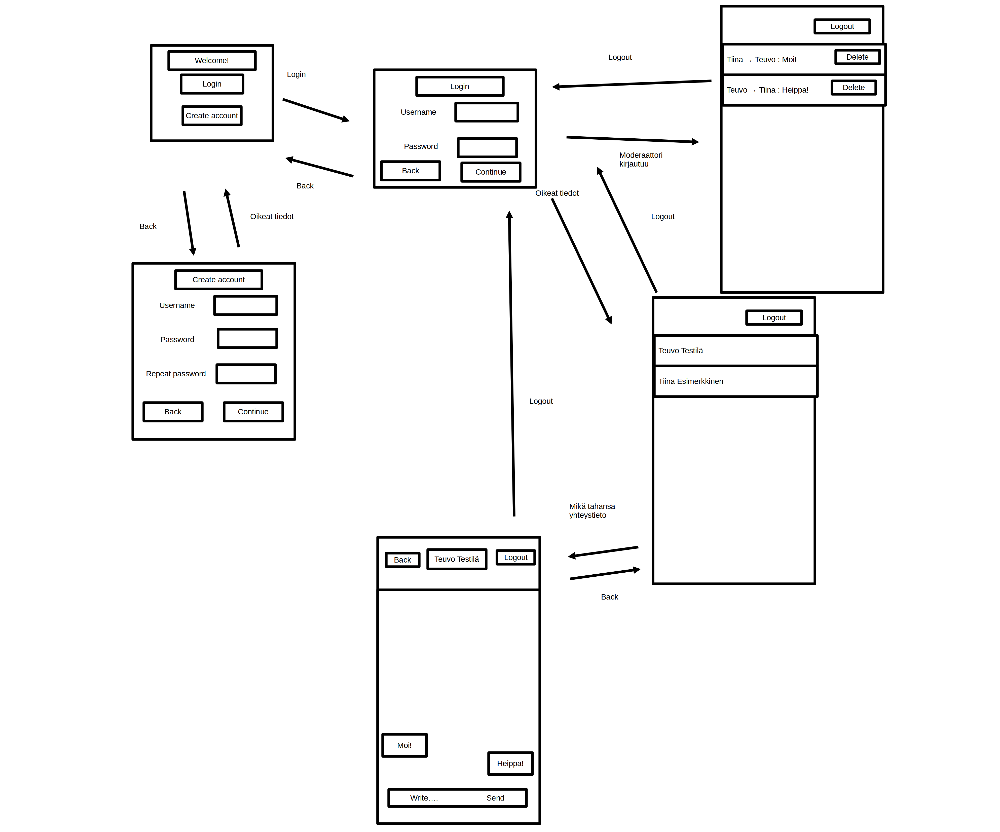

# Arkkitehtuuri

---

## Rakenne

Koko sovelluksen rakenne näyttää tältä:

Kuvassa näkyy luokat pakkausten sisällä.

````mermaid
flowchart
    subgraph ui
        UiApp
    end
    subgraph domain
        ChatService
        Session
        User
        Message
        Moderator
    end
    subgraph dao
        UserDao
        MessageDao
        ConfigDao
    end
    UiApp --> ChatService
    UiApp --> Session
    UiApp -.-> User
    Session --> User
    ChatService --> dao
    User -.- UserDao
    ChatService -.- User
    ChatService -->Message
    UiApp -.-> Message
    Message -.- MessageDao
    ChatService -.- Moderator
    UiApp -.- Moderator
    Moderator -.- ConfigDao
````

Käyttöliittymän koodi on UiApp:in sisällä.
UiApp omistaa ChatServicen ja Sessionin.
Session kuvaa tietoa nykyisestä istunnosta, kuten minä käyttäjänä ollaan kirjauduttu sisään

UiApp tarvitsee tietoa myös muista käyttäjistä ja viesteistä.

Kun UiApp pyytää ChatServiceä tekemään jotain, useassa tapauksessa pyynnöt menevtä suoraan niistä vastaaville DAO:ille.

ChatService pitää sisällään käytössä olevat DAO:t, jotka injektoidaan sisään samalla kun ChatServiceä luodaan.

ConfigDao on laajennettavissa, mutta tällä hetkellä se siltää vain tiedot moderaattoreista.

---

## Käyttäjän viesti toiselle

Sekvenssikaavio, joka näyttää mitä tapahtuu, kun käyttäjä laittaa viestin toiselle käyttäjälle

````mermaid
sequenceDiagram
    Käyttäjä ->> UI: painaa 'send'- painiketta
    UI ->> ChatService: sendMessage(message)
    ChatService ->> MessageDao: sendMessage(message)
    MessageDao -->> MessageFileDao: 
    MessageFileDao ->> MessageFileDao: save()
    MessageFileDao ->> File: Data
    File ->> MessageFileDao: 
    MessageFileDao -->> MessageDao: 
    MessageDao ->> ChatService: 
    ChatService ->> UI: 
    UI ->> UI: Uudelleenlataus
    UI ->> Käyttäjä: 
````

---

## Moderaattorin kirjautuminen sisään

Moderaattorit kirjautuvat sisään samalla lailla kuin normaalit käyttäjät, mutta heidät ohjataan moderaattorinäkymään
kirjautumisen jälkeen.

````mermaid
sequenceDiagram
    Käyttäjä ->> UI: painaa 'continue'- painiketta
    UI ->> ChatService: login(username, password)
    ChatService ->> UserDao: login(username, password)
    UserDao -->> UserFileDao: 
    UserFileDao -->> UserDao: 
    UserDao ->> ChatService: Käyttäjää ei löydy
    ChatService ->> UI: Käyttäjää ei löydy
    UI ->> ChatService: loginModerator(username, password)
    ChatService ->> ConfigDao: login(username, password)
    ConfigDao -->> ConfigFileDao: 
    ConfigFileDao -->> ConfigDao: 
    ConfigDao ->> ChatService: Moderaattori löytyi
    ChatService ->> UI: 
    UI ->> UI: Moderaattorinäkymä
    UI ->> Käyttäjä: 
````

---

## Käyttöliittymä

Käyttöliittymässä on 6 näkymää:



Kuvan nuolet kertovat siirtymistä näkymien välillä

---

## Tiedostot

Sovellus luo 3 tiedostoa suoritushakemistoon

* users.txt
* messages.txt
* config.json

users.txt sisältää käyttäjänimet ja salasanat. messages.txt sisältää tiedot viesteistä, eli niiden lähettäjät,
vastaanottajat, aikaleimat ja sisällöt. Config.json sisältää listan moderaattoreista. Käyttäjän ei tule muokata messages.txt:tä tai users.txt:tä. config.json tiedostoa saa muokata.