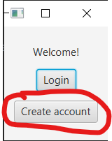
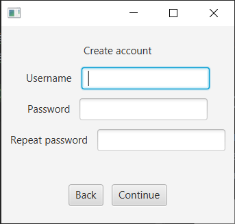
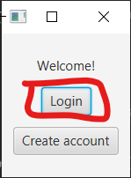
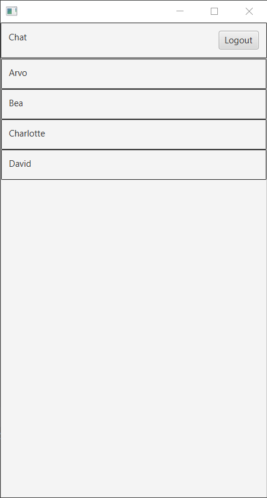
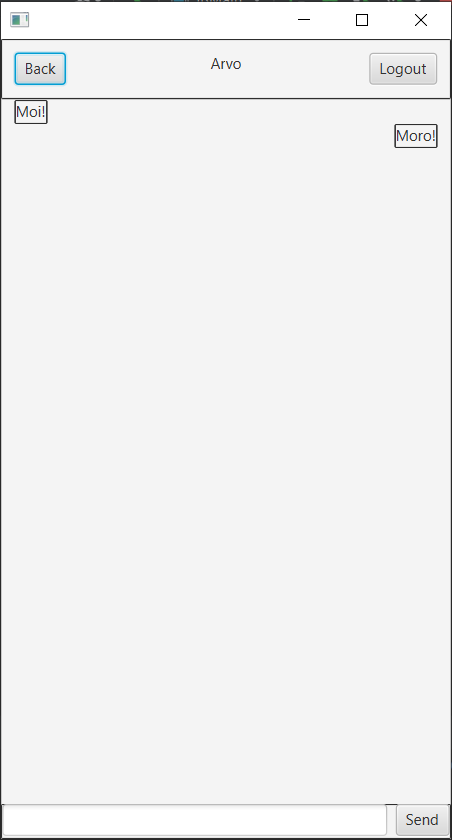
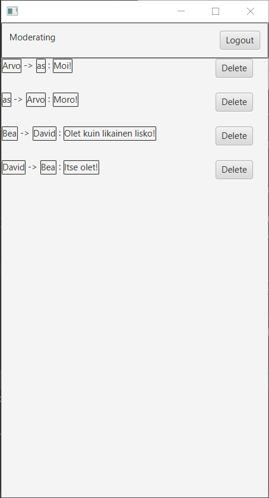

# Käyttöohje

## Ohjelman lataus

Ohjelman julkaisut löytyvät sivulta

[https://github.com/EljasV/ot-harjoitustyo/releases](https://github.com/EljasV/ot-harjoitustyo/releases)

Lataa koneellesi viimeisimmän julkaisun .jar- tiedosto

## Ohjelman käynnistys

Ohelma voidaan käynnistää komennolla

`java -jar ot-harjoitustyo-x.x.x.jar`, jossa x:t kuvastavat ohjelman versiota

## Ohjelman konfigurointi

Ohjelma luo tiedoston config.json. Tiedosto sisältää listan moderaattoreista, ja sisältää jokaisen moderaattorin nimen
ja salasanan. Tiedostoa saa muokata vapaasti, mutta sen tulee olla json-muodossa.

## Muut tiedostot

Ohjelma luo kaksi muuta tiedostoa: messages.txt ja users.txt, jotka sisältävät ohjelman omaa dataa.

## Käyttäjän luominen

Ohjelman käyttäminen tarvitsee käyttäjän.
Käyttäjän luomiseen siirytään aloitusvalikosta _Create account_- painikkeella

Käyttätilin luomiseen näkymä on seuraavanlainen:

_Username_- kenttään kirjoitetaan uusi käyttäjänimi

_Password_- kenttään kirjoitetaan tunnuksen salasana

_Repeat password_- kenttään kirjoitetaan sama salasana uudelleen.

_Back_- nappi vie takaisin aloitusnäkymään

_Continue_- nappi yrittää luoda uuden käyttäjän annetuilla tiedoilla

### Virheet käyttäjätiliä luodessa

Käyttäjätilin luominen saattaa antaa seuraavanlaisia virheitä:

* _An user with that username already exists._ Käyttäjänimi on jo käytössä: Valitse eri käyttäjänimi
* _Provided passwords are different._ Annetut salasanat ovat erilaisia: Varmista, että salasanat ovat samoja
* _Password not acceptable._ Salasana ei ole hyväksyttävä: Valitse turvallisempi salasana

## Sisäänkirjautuminen

Valitse aloitusnäkymästä _login_.

Sisäänkirjautumisnäkymä näyttää seuraavalta:

_Username_- kenttään kirjoitetaan käyttäjätunnus.

_Password_- kenttään kirjoitetaan käyttäjän salasana.

_Back_- nappi vie takaisin aloitusnäkymään.

_Continue_- nappi yrittää kirjata käyttäjän sisään.

Sisäänkirjautuminen onnistuu, jos annetut tiedot ovat oikein.

Myös moderaattorit kirjautuvat sisään tällä tavalla

## Yhteistiedon valitseminen

Yhteystietonäkymä on seuraavanlainen:

_Logout_ - napilla pääsee takaisin sisäänkirjatumisnäkymään

Voit valita yhteystiedon painamalla minkä tahansa yhteystiedon laatikosta.
Valitsemisen jälkeen avautuu viestinäkymä.

## Viestien lähettäminen

Viestinäkymä on seuraavanlainen:

_Back_- napilla pääsee takaisin yhteystietonäkymään

_Logout_- napilla pääsee takaisin sisäänkirjautumisnäkymään

Keskellä näkyy lähetetyt ja vastaanotetut viestit

Alhaalla on laatikko lähetettävälle viestille ja sen vieressä oleva _Send_- nappi lähettää viestin.

## Moderaationäkymä

Moderaattorinäkymään päästään kirjautumalla sisään moderaattorin tunnuksilla, jotka on määritelty config.json-
tiedostossa.

Moderaattorinäkymä näyttää seuraavalta:

Viestit näkyvät keskellä allekkain muodossa
`lähettäjä -> Vastaanottaja : Viesti`
Jokaisen viestin oikealla puolella on _Delete_- nappi, jota painamalla viestin pystytään poistamaan