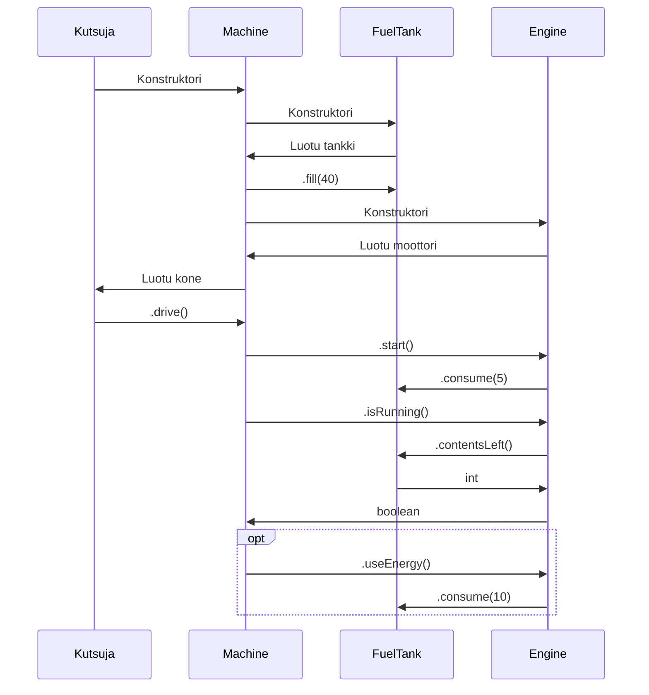

# T3 Bensatankki

```mermaid
sequenceDiagram
    participant Ku as Kutsuja
    participant Ma as Machine
    participant Ft as FuelTank
    participant En as Engine
    
    
    Ku ->> Ma: Konstruktori
    Ma ->> Ft: Konstruktori
    Ft ->> Ma: Luotu tankki
    Ma ->> Ft: .fill(40)
    Ma ->> En: Konstruktori
    En ->> Ma: Luotu moottori
    Ma ->> Ku: Luotu kone
    
    Ku ->> Ma: .drive()
    Ma ->> En: .start()
    En ->> Ft: .consume(5)
    Ma ->> En: .isRunning()
    En ->> Ft: .contentsLeft()
    Ft ->> En: int
    En ->> Ma: boolean
    opt 
        Ma ->> En: .useEnergy()
        En ->> Ft: .consume(10)
    end
```