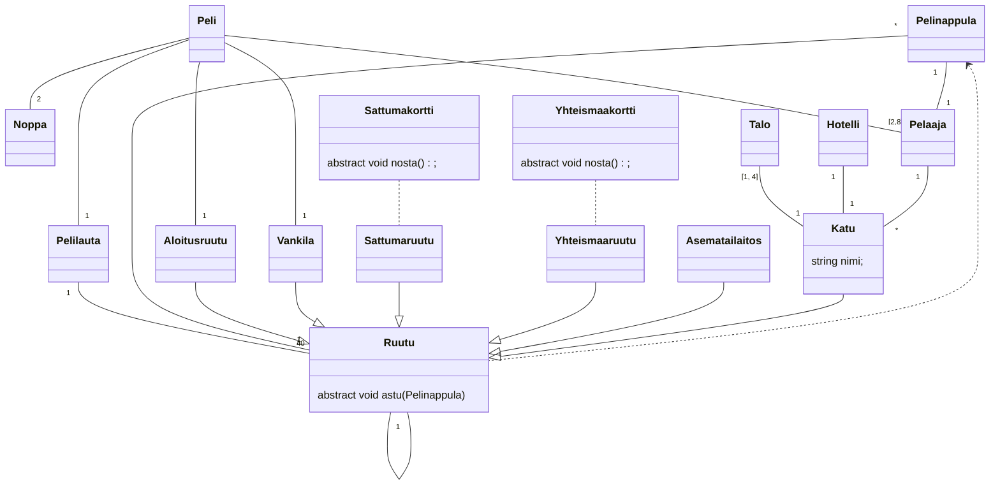

# T1-2 Monopoli

```mermaid
classDiagram
    Peli -- "2" Noppa
    Peli -- "[2,8]" Pelaaja
    Peli -- "1" Pelilauta
    Pelilauta "1" -- "40" Ruutu
    Ruutu -- "1" Ruutu
    Pelinappula  "1" -- "1" Pelaaja
    Pelinappula "*" -- "1" Ruutu
    Aloitusruutu --|> Ruutu
    Vankila --|>  Ruutu
    Sattumaruutu --|> Ruutu
    Yhteismaaruutu --|> Ruutu
    Asema tai laitos --|> Ruutu
    Katu --|> Ruutu
    
    Peli -- "1" Aloitusruutu
    Peli -- "1" Vankila
    
    Sattumakortti .. Sattumaruutu
    Yhteismaakortti .. Yhteismaaruutu
    
    Pelinappula <.. Ruutu
    
    Talo "[1, 4]" -- "1" Katu
    Hotelli "1" -- "1" Katu
    Pelaaja "1" -- "*" Katu
    
    
    class Ruutu{
        abstract void astu(Pelinappula)
    }
    
    class Katu{
        string nimi;
    }
    
    class Sattumakortti{
        abstract void nosta();
    }
    class Yhteismaakortti{
        abstract void nosta();
    }
    
    
    
```